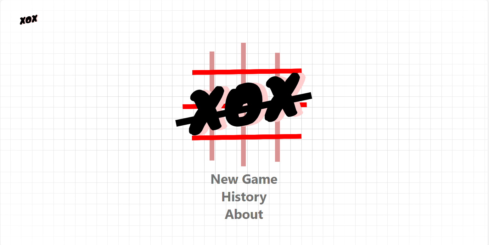

# React + Vite

This template provides a minimal setup to get React working in Vite with HMR and some ESLint rules.

Currently, two official plugins are available:

- [@vitejs/plugin-react](https://github.com/vitejs/vite-plugin-react/blob/main/packages/plugin-react/README.md) uses [Babel](https://babeljs.io/) for Fast Refresh
- [@vitejs/plugin-react-swc](https://github.com/vitejs/vite-plugin-react-swc) uses [SWC](https://swc.rs/) for Fast Refresh

<!-- TABLE OF CONTENTS -->
<details>
  <summary>Table of Contents</summary>
  <ol>
    <li>
      <a href="#about-the-project">About The Project</a>
      <ul>
        <li><a href="#built-with">Built With</a></li>
      </ul>
    </li>
    <li>
      <a href="#getting-started">Getting Started</a>
      <ul>
        <li><a href="#prerequisites">Prerequisites</a></li>
        <li><a href="#installation">Installation</a></li>
      </ul>
    </li>
    <li><a href="#usage">Usage</a></li>
    <li><a href="#roadmap">Roadmap</a></li>
    <li><a href="#contributing">Contributing</a></li>
    <li><a href="#license">License</a></li>
    <li><a href="#contact">Contact</a></li>
    <li><a href="#acknowledgments">Acknowledgments</a></li>
  </ol>
</details>

<!-- ABOUT THE PROJECT -->
## About The Project

[![Product Name Screen Shot][product-screenshot]](https://example.com)

There are many great README templates available on GitHub; however, I didn't find one that really suited my needs so I created this enhanced one. I want to create a README template so amazing that it'll be the last one you ever need -- I think this is it.

Here's why:
* Your time should be focused on creating something amazing. A project that solves a problem and helps others
* You shouldn't be doing the same tasks over and over like creating a README from scratch
* You should implement DRY principles to the rest of your life :smile:

Of course, no one template will serve all projects since your needs may be different. So I'll be adding more in the near future. You may also suggest changes by forking this repo and creating a pull request or opening an issue. Thanks to all the people have contributed to expanding this template!

Use the `BLANK_README.md` to get started.

<p align="right">(<a href="#readme-top">back to top</a>)</p>


### Built With

This section should list any major frameworks/libraries used to bootstrap your project. Leave any add-ons/plugins for the acknowledgements section. Here are a few examples.

* [![Next][Next.js]][Next-url]
* [![React][React.js]][React-url]
* [![Vue][Vue.js]][Vue-url]
* [![Angular][Angular.io]][Angular-url]
* [![Svelte][Svelte.dev]][Svelte-url]
* [![Laravel][Laravel.com]][Laravel-url]
* [![Bootstrap][Bootstrap.com]][Bootstrap-url]
* [![JQuery][JQuery.com]][JQuery-url]

<p align="right">(<a href="#readme-top">back to top</a>)</p>




 


Creating a Tic-Tac-Toe game using React.js, Framer Motion, and Tailwind CSS for the frontend, and Node.js with Express, Prisma, and MongoDB for the backend involves integrating these technologies to deliver a seamless and visually appealing user experience

### Frontend (React.js, Framer Motion, Tailwind CSS, Zustand , tailwind merge ,):

* Utilize React's component-based architecture to create reusable UI components for the game board, cells, and user interface elements.
*  Implement smooth animations for transitions, user interactions, and game events to enhance the visual appeal and user engagement.
*  Apply responsive and customizable styles to components using Tailwind's utility-first CSS framework, ensuring a consistent and visually appealing design across different screen sizes.

### Backend (Node.js, Express, Prisma, MongoDB):

* Build a RESTful API server using Node.js and Express to handle HTTP requests and responses, including game state updates, user authentication, and data retrieval.

* Integrate Prisma as an ORM (Object-Relational Mapping) tool to interact with the MongoDB database, simplifying database operations such as CRUD (Create, Read, Update, Delete) operations and data modeling.

* Use MongoDB as the database for storing game data, player information, and game statistics, leveraging its flexibility, scalability, and document-based data model for efficient storage and retrieval.

### Deployment (Vercel for frontend, Render for Backend):

* Utilize Vercel's platform for hosting and deploying frontend applications, providing seamless integration with Git repositories and support for React.js applications out of the box.

* Deploy the Node.js backend server on Render, a modern cloud provider that offers managed infrastructure and automatic scaling for web applications.

* Configure CORS policies on the backend server to allow requests from the frontend hosted on Vercel, enabling seamless communication between the client-side and server-side components.

<p align="right">(<a href="#readme-top">back to top</a>)</p>

### Built With

This section should list any major frameworks/libraries used to bootstrap your project. Leave any add-ons/plugins for the acknowledgements section. Here are a few examples.

* [![React][React.js]][React-url]
* [![Express][Express.js]][Express-url]
* [![MongoDB][MongoDB]][MongoDB-url]
* [![Node.js][Node.js]][Node.js-url]
* [![Prisma][Prisma]][Prisma-url]
* [![Tailwind CSS][Tailwind.css]][Tailwind-css-url]
* [![Framer Motion][Framer.motion]][Framer-motion-url]
* [![UI.Shadcn][UI.Shadcn]][UI.Shadcn-url]
* [![Zustand][Zustand]][Zustand-url]


<p align="right">(<a href="#readme-top">back to top</a>)</p>

<!-- GETTING STARTED -->
## Getting Started

to get a local copy must have first a mongodb account render account and vercel account

### Prerequisites

This is an example of how to list things you need to use the software and how to install them.
* npm
  ```sh
  npm install -g yarn  yarn add 
  ```

### Installation

setting up just follow the instructions

1. Fork & clone repository:
   ```sh
   git clone https://github.com/cybr2/ticTacToe-fe.git
   ```
2. Install the dependencies:
   ```sh
   yarn or npm install
   ```
3. Run the development server:
   ```
    yarn dev or npm run ev
   ```

<p align="right">(<a href="#readme-top">back to top</a>)</p>


<!-- USAGE EXAMPLES -->
## Usage

This application combines React.js, Framer Motion, and Tailwind CSS for a sleek and interactive frontend experience. On the backend, Node.js, Express.js, Prisma, and MongoDB provide a solid foundation for building RESTful APIs and managing data. With Vercel and Render for deployment, developers can easily showcase their creations. Plus, the classic Tic-Tac-Toe game play ensures both educational and enjoyable experiences for all users. 

<p align="right">(<a href="#readme-top">back to top</a>)</p>


<!-- ROADMAP -->
## Roadmap

- [x] low fidelity wireframe
- [x] header 
- [x] landing page 
- [x] new game modal
- [x] game board
- [x] game over modal
- [x] history
- [x] about
- [x] data persistency
- [x] api for getting the game session
- [x] api for saving the game session
- [x] create connection for database
- [x] deployed frontend to vercel
- [x] deployed backend to render

<a href="https://tic-tac-toe-fe-nine.vercel.app/"  > 
    link for tic-tac-toe game
</a>
<a href="https://tic-tac-toe-fe-nine.vercel.app/"  > 
    link for tic-tac-toe game fe
</a>
<a href="https://tictactoe-be-cybr2.onrender.com/"  > 
    link for tic-tac-toe game be
</a>

<p align="right">(<a href="#readme-top">back to top</a>)</p>

<!-- CONTRIBUTING -->
## Contributing

Contributions are what make the open source community such an amazing place to learn, inspire, and create. Any contributions you make are **greatly appreciated**.

If you have a suggestion that would make this better, please fork the repo and create a pull request. You can also simply open an issue with the tag "enhancement".
Don't forget to give the project a star! Thanks again!

1. Fork the Project
2. Create your Feature Branch (`git checkout -b feature/AmazingFeature`)
3. Commit your Changes (`git commit -m 'Add some AmazingFeature'`)
4. Push to the Branch (`git push origin feature/AmazingFeature`)
5. Open a Pull Request

<p align="right">(<a href="#readme-top">back to top</a>)</p>


<!-- LICENSE -->
## License

Distributed under the MIT License. See `LICENSE.txt` for more information.

<p align="right">(<a href="#readme-top">back to top</a>)</p>


<!-- CONTACT -->
## Contact

linkedin : [https://www.linkedin.com/in/ydoow/](https://www.linkedin.com/in/ydoow/)

Project Link: [https://github.com/cybr2/ticTacToe-fe.git](https://github.com/cybr2/ticTacToe-fe.git)

<p align="right">(<a href="#readme-top">back to top</a>)</p>


<!-- ACKNOWLEDGMENTS -->
## Acknowledgments

giving credits to all the resources i've use to build this project

<p align="right">(<a href="#readme-top">back to top</a>)</p>

